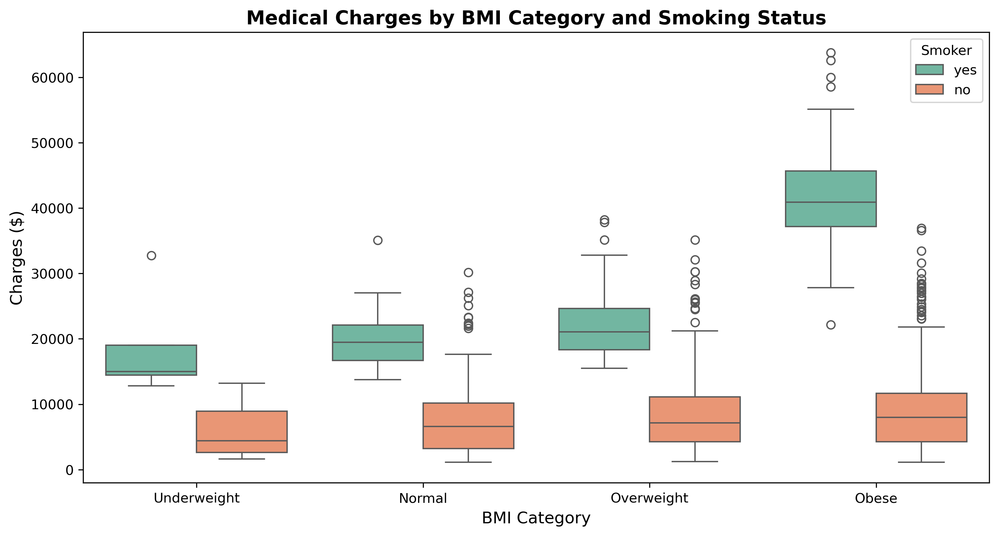
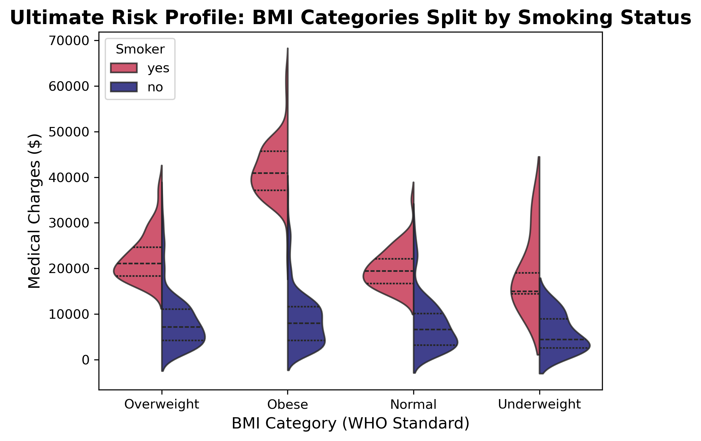
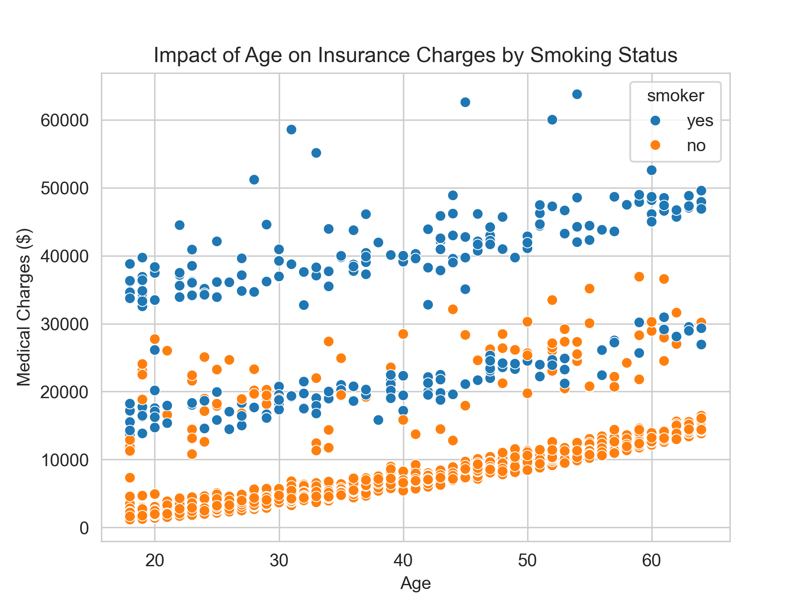
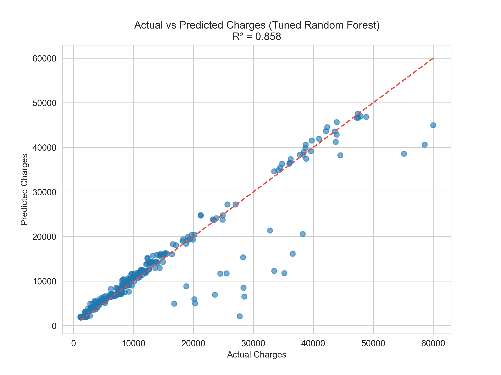
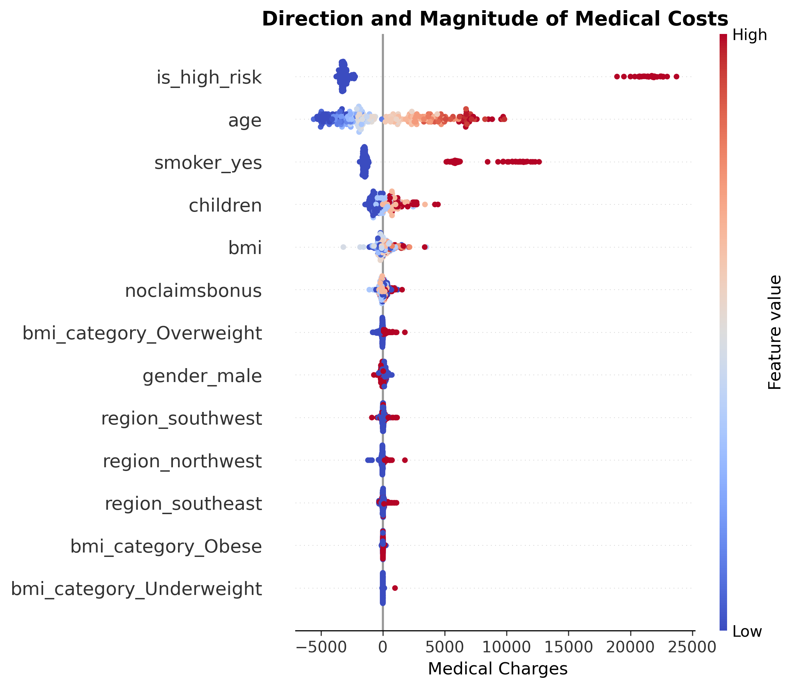

# Health Insurance Risk & Pricing Optimization
## Executive Summary

In the highly competitive health insurance market, accurately pricing risk is the primary driver of profitability. Mispricing high-risk policyholders directly erodes profit margins, while overcharging low-risk individuals leads to customer churn.

This project analyzes a portfolio of 1,338 beneficiaries to identify the true cost drivers behind medical claims. The analysis reveals that compounding lifestyle factors—specifically the intersection of smoking and clinical obesity—inflate average claim costs by nearly **500%** compared to baseline policyholders.

Instead of treating risk as a flat metric, this project provides a data-driven framework for:
1.	**Dynamic Risk Pricing:** Adjusting baseline premiums to account for overlapping risk variables.
2.	**Proactive Margin Protection:** Identifying specific high-risk cohorts for targeted, preventative wellness interventions to optimize the company's overall loss ratio.

## The Business Problem
Traditional insurance pricing often relies on broad demographic buckets (e.g., age and gender). However, this approach fails to capture the nuance of behavioral health risks. The objective of this analysis is to transition from a reactive pricing model to a predictive, behavioral-based pricing strategy by answering: 

•	What are the most expensive risk profiles in our current portfolio? 
• How can we structurally adjust premiums to reflect true expected medical costs?

## Key Financial Drivers & Insights
Through rigorous Exploratory Data Analysis (EDA) and statistical testing, several critical financial drivers were identified:  
**The Compounding Effect of Smoking and Obesity:** Smoking alone is the largest standalone driver of medical costs. However, when combined with obesity (BMI > 30), the costs become multiplicative.  

Obese smokers average **~$41,600** in annual claims, whereas obese non-smokers average only **~$8,800**.

**Age vs. Lifestyle:** 

While medical costs naturally trend upward with age, the baseline cost for a 20-year-old smoker is frequently higher than the baseline cost for a 60-year-old healthy non-smoker. Lifestyle dictates cost far more heavily than age alone.

## Strategic Recommendations 
Based on the data analysis, I recommend the following data-driven business strategies to optimize profit margins and improve risk management:
1.	Risk-Mitigation through Targeted Wellness Programs (ROI Focus):

**Data Insight:** Customers with a BMI > 30 who smoke incur average annual claims of **~$41,600**, which is nearly **5x higher** than obese non-smokers (~$8,800). 
**Recommendation:** Launch a targeted “Healthy Habits” program specifically for this high-risk cohort. Subsidizing gym memberships or smoking cessation programs (e.g., spending $500/year per user) offers massive ROI by potentially preventing long-term chronic disease payouts and shifting these policyholders to a lower-risk tier.

2. Dynamic Risk-Based Pricing Model:

**Data Insight:** The interaction effect between smoking and high BMI is multiplicative, not additive. 
**Recommendation:** Instead of flat baseline increases, implement a multi-tiered premium structure. Base premiums should dynamically adjust using a compounding multiplier for policyholders exhibiting overlapping risk factors. This prevents the business from underpricing high-risk policies while allowing us to offer highly competitive rates to low-risk, healthy individuals.

3. Optimizing Family Packages for Customer Acquisition:
   
**Data Insight:** Adding dependents (from 0 to 3 children) only marginally increases the average medical costs (from ~$12,200 to ~$15,400). It does not exponentially inflate medical risks per household. 
**Recommendation:** The company should design aggressive, flat-rate “Family Bundle” packages for households with 2-3 children. This strategy can be used to capture market share and attract younger, growing families (who generally represent high Customer Lifetime Value – CLV) with minimal additional risk to the overall insurance pool.

## Predictive Modeling Application 

To operationalize these insights, a dual-model approach was developed:
Machine Learning & Explainable AI: A Random Forest Regressor (R^2 = 0.83) was trained to forecast expected charges. To avoid "black-box" deployment, SHAP (Shapley Additive exPlanations) values were extracted, proving the engineered is_high_risk feature adds an $18k-$23k penalty.

Actuarial Pricing Engine (GLM): To meet insurance regulatory standards, a Generalized Linear Model (Gamma-distributed with Log-link) was deployed. This provided concrete mathematical multipliers (e.g., Smoker Penalty = 3.09x) rather than flat baseline increases.

## Data & Technical Architecture
Dataset Overview
The dataset contains demographic and billing data for primary beneficiaries. 
**Target Variable:** `charges` (Individual medical costs billed by health insurance). 
Data Extraction & Integrity Pipeline Real-world data requires a robust, multi-step pipeline. For this project, data handling was split between database-level ETL transformations and Python-level analytical wrangling: 
**1. SQL Data Extraction (ETL)**: Raw data was extracted from a normalized PostgreSQL enterprise database (policyholders, medical_history, claims_billing). An advanced SQL pipeline (utilizing CTEs and Window Functions) was used to deduplicate records, engineer initial features (BMI), and handle baseline nulls via COALESCE(). 
**2. Python Analytical Cleaning:** Once loaded into the analytical environment via Pandas, deeper integrity checks were performed:
- Imputation: Missing numerical values (e.g., children or bmi) were imputed using group medians to maintain distribution integrity. Missing categorical values were handled using mode imputation.
- Outlier Strategy: Outliers in medical charges were explicitly retained rather than dropped. In actuarial science, these represent legitimate, catastrophic medical events that are critical to accurately modeling the insurance risk pool.

## Tools & Technologies
**Python** (Pandas, NumPy, Matplotlib, Seaborn, SciPy, Scikit-Learn, SHAP, Statsmodels)
* **PostgreSQL** (Advanced ETL & Window Functions)
* **Jupyter Notebook**
* **GitHub** (Project documentation & version control)

---

## 👤 Author
**Baasankhuu**  
Data Analyst | Python • Data Visualization • Statistics • SQl • Power BI
