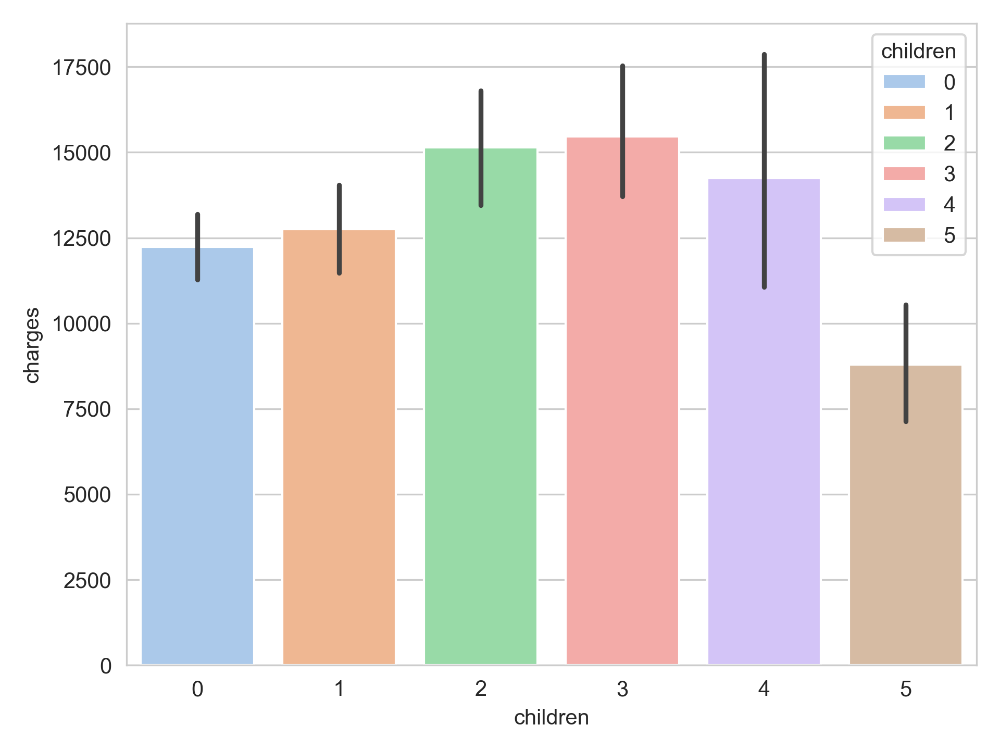

# Health Insurance Risk & Pricing Optimization
## Executive Summary

Accurate risk pricing is central to profitability in health insurance. Underpricing high-risk policyholders can materially weaken margins, while overpricing lower-risk customers can reduce competitiveness and retention.

This project analyzes a portfolio of 1,338 beneficiaries to identify the primary drivers of medical charges and develop a more risk-sensitive pricing framework. The analysis finds that medical costs are not explained by demographics alone. Instead, overlapping lifestyle factors—particularly smoking and clinical obesity—are associated with substantially higher claim costs. In this dataset, obese smokers show average charges of approximately $41.6k, compared with approximately $8.8k for obese non-smokers.

Rather than treating risk as a single flat adjustment, this project develops a data-driven framework to support: 
1. **Risk-based pricing:** aligning premium logic more closely with underlying cost drivers 
2. **Portfolio protection:** identifying concentrated high-cost segments for targeted intervention 
3. **Commercial strategy:** evaluating customer segments that may support competitive product design 

## Business Problem
Traditional insurance pricing often relies heavily on broad demographic variables such as age and gender. While useful, this approach can miss the commercial importance of behavioral and interaction-based risk factors.

This project addresses two core questions: 
•	Which customer profiles are associated with the highest expected medical costs? 
• How can pricing logic better reflect true expected risk while remaining interpretable for business use?

## Key Financial Drivers & Insights

The analysis combines exploratory data analysis, statistical testing, and predictive modeling to identify the most commercially relevant cost drivers.

### **1. Smoking and obesity form the most important high-cost interaction:** 

Smoking is the strongest standalone cost driver in the dataset. However, its financial effect becomes materially larger when combined with clinical obesity. Obese smokers show average annual charges of approximately $41,600, compared with approximately $8,800 for obese non-smokers. This interaction represents the most commercially significant high-cost segment in the portfolio.
  
 This chart highlights the most commercially important interaction in the dataset: the combination of smoking and obesity. It shows that medical charges increase sharply for smokers in the obese BMI category, making this segment the clearest high-cost cohort in the portfolio. 
### **2. A small high-risk segment drives a disproportionate share of total costs:** 

The identified high-risk cohort—policyholders who are both smokers and obese—represents only 10.8% of the customer base, but accounts for 34.0% of total medical charges. This concentration suggests that pricing and intervention decisions targeted at a relatively small segment could have disproportionate financial value.
  
 This visual shows the concentration of financial risk in the portfolio. Although the high-risk segment represents only a small share of policyholders, it contributes a disproportionately large share of total medical costs. 
### **3. Lifestyle factors shift the baseline more sharply than age alone** 

Medical costs generally increase with age, but the effect of smoking materially shifts the baseline cost level. In many cases, a younger smoker begins at a higher expected cost level than an older non-smoker, indicating that lifestyle-related risk can outweigh purely demographic effects.
 
### **4. Dependents increase costs, but not proportionally** 

Moving from 0 to 3 dependents increases average medical charges from roughly $12.2k to $15.4k. The increase is meaningful, but relatively moderate compared with smoking-related risk. This suggests that family-oriented product design may be commercially viable if structured carefully.

 

## Strategic Recommendations 
Based on the analysis, the following actions appear commercially relevant:

### 1.	Targeted wellness intervention for the highest-cost segment:

**Data Insight:** obese smokers incur average annual charges of approximately $41.6k, nearly 5x the level observed among obese non-smokers. 
**Recommendation:** evaluate a targeted health intervention strategy for this segment, such as smoking cessation support or preventative wellness programs. Even modest reductions in claims frequency or severity within this group could improve portfolio performance.

### 2. Risk-Based Pricing structure:

**Data Insight:** the interaction between smoking and high BMI is stronger than the effect of either factor in isolation. 
**Recommendation:** move from flat premium adjustments toward a more structured risk-based pricing approach that reflects compounding risk factors. This would help reduce underpricing of high-risk profiles while preserving more competitive pricing for lower-risk customers.

### 3. Family-oriented product strategy
   
**Data Insight:** costs rise with dependents, but not at an exponential rate. 
**Recommendation:** explore family bundle pricing for households with 2–3 children, while applying suitable guardrails to reduce adverse selection risk. A capped family pricing structure may improve commercial appeal without materially overexposing the portfolio.

## Predictive Modeling Application 

To operationalize the findings, the project uses a dual-model framework combining predictive performance with interpretability.

This plot compares actual and predicted medical charges from the final Random Forest model. The alignment around the diagonal indicates that the model captures a substantial share of variation in individual-level charges.

### Machine Learning and Explainability

A Random Forest Regressor was trained to estimate expected medical charges, achieving an R² of 0.83 on the test set. To improve interpretability, SHAP values were used to quantify the directional contribution of each feature. The engineered is_high_risk feature emerged as one of the strongest drivers of predicted charges, with a substantial positive effect on expected cost.

### Interpretable Pricing Engine

Because pricing decisions often require transparent logic, a Gamma Generalized Linear Model (GLM) with a log link was also developed. This model translates risk characteristics into interpretable premium multipliers, making it more suitable for pricing communication and business application than a purely black-box predictive model.

For example, the GLM produced explicit multiplier estimates such as:

Smoker penalty: 3.09x 
High-risk interaction (obese + smoker): 1.87x 
Dependent effect: 1.10x per child

This chart translates analytical findings into interpretable pricing logic. The GLM output expresses major risk factors as premium multipliers, making the results easier to communicate and apply in a pricing context.

## Data & Technical Architecture
### Dataset Overview

The dataset contains demographic, lifestyle, and billing-related information for primary beneficiaries. 
**Target Variable:** `charges` (Individual medical costs billed by health insurance). 
### Data Extraction & Integrity Pipeline 

This project was designed to reflect a production-style analytics workflow, with data handling split between SQL-based extraction logic and Python-based analytical preparation. 
#### **1. SQL Data Extraction (ETL)**: A PostgreSQL pipeline was used to simulate warehouse-style extraction and transformation: 
* joined policyholder, medical history, and claims data
* calculated BMI from height and weight inputs
* used CTEs to structure the transformation flow
* applied window functions to aggregate annual claims and deduplicate records
* handled baseline nulls using COALESCE()
  
#### **2. Python Analytical Cleaning:** After loading the extracted dataset into Pandas, additional preparation steps were applied:
* corrected inconsistent region values
* imputed missing numerical and categorical values
* removed rows with missing target values
* converted children to integer type
* reviewed likely data-entry outliers in children
* retained extreme charge values, as these are commercially important in insurance risk modeling

## Statistical and Modeling Approach

The project includes: 
* exploratory data analysis to identify cost patterns
* hypothesis testing to validate group-level differences
* ANOVA to test charge differences across BMI categories
* confidence interval estimation for the mean charge
* baseline model comparison across multiple algorithms
* cross-validation for model stability
* hyperparameter tuning for Random Forest
* SHAP analysis for feature-level interpretability
* Gamma GLM for interpretable premium multipliers
  
## Tools & Technologies
**Python:** Pandas, NumPy, Matplotlib, Seaborn, SciPy, Scikit-Learn, SHAP, Statsmodels
* **SQL:** PostgreSQL, CTEs, Window Functions
* **Environment:** Jupyter Notebook
* **Version Control:** Git, GitHub

---

## Author
**Baasankhuu Davaatogtokh**  
Data Analyst | SQl • Python • Power BI • Statistics • Data Visualization  
